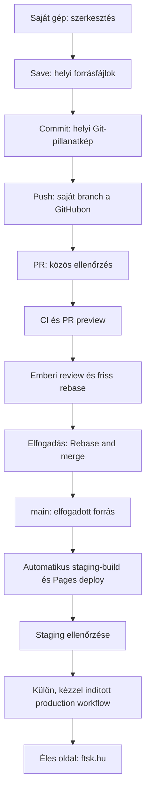
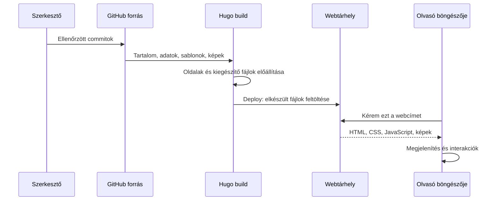
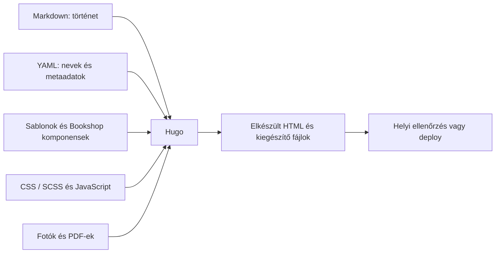
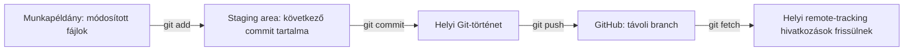
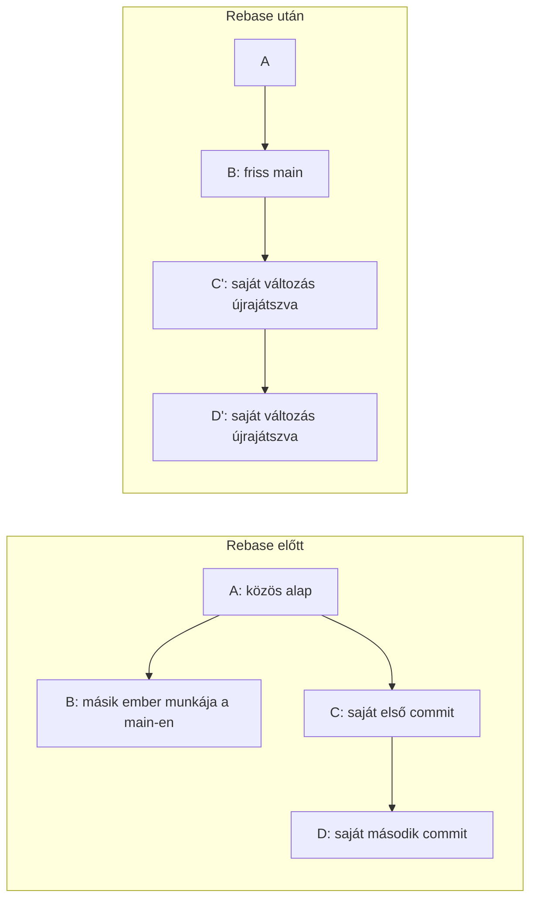
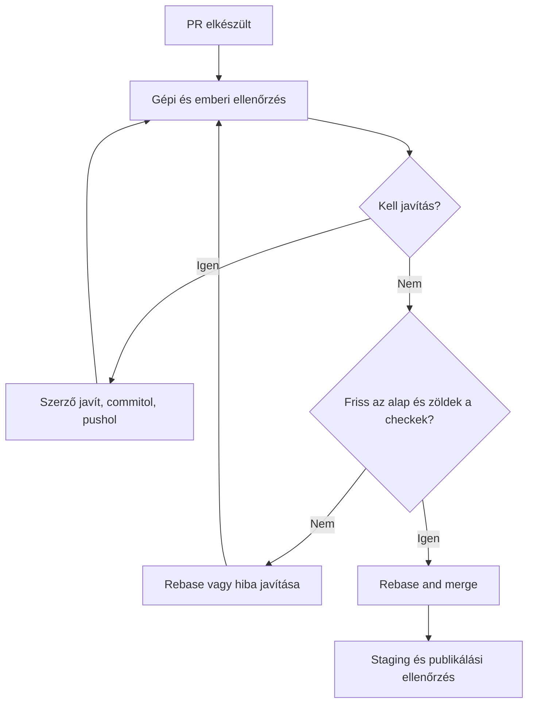
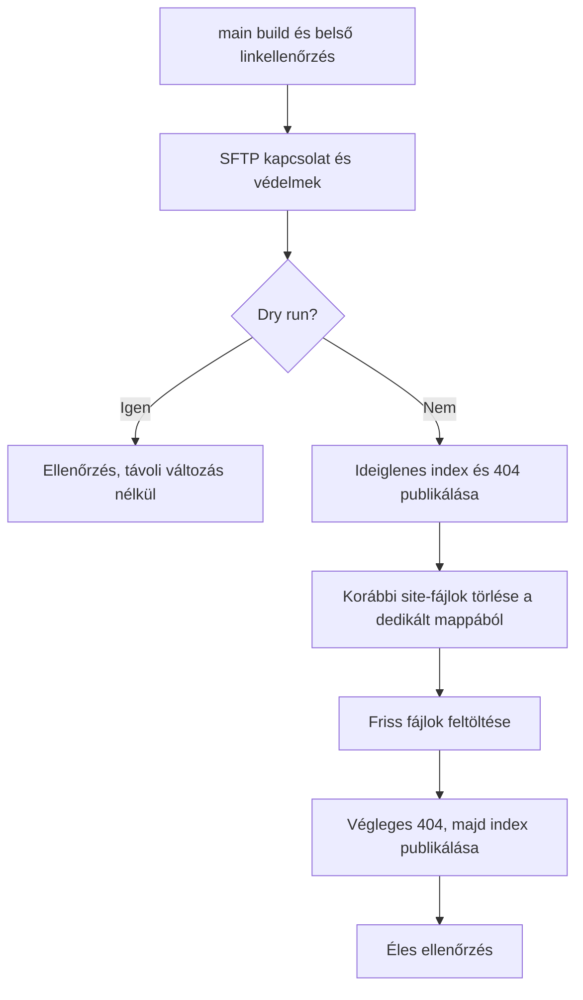

# Nulláról magabiztos szerkesztőig

## Az FTSK weboldal, a Git és a GitHub közérthető tanulókönyve

Ez az útmutató azoknak készült, akik még nem fejlesztők, de szeretnének
túrabeszámolókat, tanfolyamokat vagy képeket szerkeszteni, és közben
biztonságosan együtt dolgozni a többiekkel.

**Nem kell mindent egyszerre megtanulnod.** Először azt értjük meg, mi hol
található és mi történik egy módosítással. Utána megismerjük a szerkesztést,
a változások követését, a közös ellenőrzést, végül az automatizált építést
és közzétételt.

### Mit fogsz tudni a végére?

- Elmondani, mi a forrás, mi az elkészült weboldal, és mit jelent a build.
- Megkülönböztetni a saját gépedet, a GitHubot, az előnézetet és az éles oldalt.
- Szerkeszteni a böngészős munkafelülettel és megérteni a Markdown/YAML alapjait.
- Saját branchen dolgozni, értelmes commitokat készíteni és PR-t nyitni.
- Rebase segítségével frissíteni a munkádat merge commitok nélkül.
- Visszajelzést adni és fogadni, ellenőrizni a CI eredményét.
- Tudni, mikor biztonságos továbblépni, és mikor kell segítséget kérni.

### Javasolt tanulási sorrend

| Szakasz | Cél | Mikor menj tovább? |
| --- | --- | --- |
| 1–4. fejezet | Megérteni a térképet és az alapfogalmakat | El tudod mondani, miért nem publikál a Save gomb |
| 5–7. fejezet | Helyben tartalmat készíteni | Létrehoztál egy saját draftot és megnézted telefonméretben |
| 8–11. fejezet | Git, PR és rebase | Tudod, melyik branchen vagy, és mit tartalmaz a következő commit |
| 12–15. fejezet | Review, CI/CD, staging és production | Meg tudod különböztetni a hibás buildet a hibás deploytól |
| 16–19. fejezet | Önálló munkavégzés | Végigcsináltad a gyakorló feladatot és az ellenőrzőlistát |

Az angol feliratokat megtartjuk ott, ahol a GitHub vagy a munkafelület is
ezeket használja. Az első előfordulásnál magyarul is megmagyarázzuk őket.

**Branch** (ejtsd: „brencs”): a Gitben egy névvel ellátott fejlesztési vonal.
Saját branchen úgy dolgozhatsz egy változtatáson, hogy közben nem módosítod
a közösen elfogadott `main` branch tartalmát. Nem külön mappa és nem külön
weboldal; a részletes magyarázatot a [Git-fejezetben](#branch-külön-fejlesztési-vonal) találod.

> **A hat legfontosabb különbség:** Save ≠ Commit ≠ Push ≠ PR elfogadása ≠
> Build ≠ Production deploy. Ezek egymásra épülő, külön lépések.

## Tartalomjegyzék

1. [A weboldal mint közösen készített könyv](#1-a-weboldal-mint-közösen-készített-könyv)
2. [Hogyan jut az információ az olvasóhoz?](#2-hogyan-jut-az-információ-az-olvasóhoz)
3. [Mi az a build, és mi az a deploy?](#3-mi-az-a-build-és-mi-az-a-deploy)
4. [A technológiai készlet és a mappák](#4-a-technológiai-készlet-és-a-mappák)
5. [Az első helyi munkakörnyezet](#5-az-első-helyi-munkakörnyezet)
6. [Szerkesztés a Site Workbench segítségével](#6-szerkesztés-a-site-workbench-segítségével)
7. [Markdown, YAML, képek és shortcode-ok](#7-markdown-yaml-képek-és-shortcode-ok)
8. [Git: mit követünk, és hol?](#8-git-mit-követünk-és-hol)
9. [Az első saját branch és commit](#9-az-első-saját-branch-és-commit)
10. [GitHub és Pull Request](#10-github-és-pull-request)
11. [Rebase: frissítés merge commit nélkül](#11-rebase-frissítés-merge-commit-nélkül)
12. [A review mint közös minőségellenőrzés](#12-a-review-mint-közös-minőségellenőrzés)
13. [CI/CD: a munkát segítő automatizálás](#13-cicd-a-munkát-segítő-automatizálás)
14. [Az FTSK tényleges pipeline-ja](#14-az-ftsk-tényleges-pipeline-ja)
15. [Staging, production és felelős publikálás](#15-staging-production-és-felelős-publikálás)
16. [Hibakeresés és visszaállítás](#16-hibakeresés-és-visszaállítás)
17. [Végigvezetett gyakorló feladat](#17-végigvezetett-gyakorló-feladat)
18. [Napi ellenőrzőlisták és parancspuska](#18-napi-ellenőrzőlisták-és-parancspuska)
19. [Szótár és további olvasnivaló](#19-szótár-és-további-olvasnivaló)

---

## 1. A weboldal mint közösen készített könyv

Képzelj el egy egyesületi évkönyvet.

- Valaki megírja a beszámolót.
- Egy másik ember kiválasztja a fotókat.
- A szerkesztő ellenőrzi a neveket, dátumokat és a tördelést.
- A nyomda elkészíti a nyomtatható változatot.
- Az egyesület dönt arról, melyik kiadás kerül az olvasókhoz.

A weboldalnál hasonló szerepek vannak:

| Könyves hasonlat | Weboldalas megfelelő |
| --- | --- |
| Kézirat és eredeti fotók | Forrásfájlok |
| Saját munkapéldány | A repository másolata a gépeden |
| Követhető javításjegyzék | Git történet |
| Közös szerkesztőségi hely | GitHub repository |
| „Nézzétek át az új fejezetemet!” | Pull Request, röviden PR |
| Lektorálás | Review |
| Tördelés és nyomdai előállítás | Build |
| Mintapéldány | Preview vagy staging |
| Végleges kiadás terjesztése | Production deploy |

A hasonlat nem tökéletes: egy új weboldal-build sokszor a teljes könyvet
újra előállítja, nem csak az egy megváltozott oldalt. Ez segít abban,
hogy a tartalomjegyzékek, kereső és kapcsolódó cikkek is összhangban legyenek.

### Három szerep, nem három kötelező ember

**Szerző/szerkesztő:** a tartalomért, nevekkel és képekkel együtt, felel.

**Reviewer:** egy második szempár. Megnézi a szöveget, változásokat és előnézetet.

**Publikáló/karbantartó:** jóváhagyott tartalmat tesz közzé, és szükség esetén
a technikai környezetet kezeli.

Kis csapatban egy ember több szerepet is betölthet. Ettől még érdemes
különválasztani a „megírtam”, „ellenőriztük” és „élesítettük” döntéseket.

### Nem baj, ha valamit még nem tudsz

Nem kell programozónak lenned egy beszámoló javításához. Azt viszont
érdemes mindig tudnod:

1. Melyik branchen vagy?
2. Mit változtattál?
3. Csak a gépeden van-e, vagy már feltöltötted?
4. Melyik előnézetet nézed?
5. Éles oldalról van-e szó?

Ha ezek közül valamelyik bizonytalan, előbb állj meg, és tisztázd.

## 2. Hogyan jut az információ az olvasóhoz?

### A helyek térképe

**Saját gép:** itt írsz, képet konvertálsz és kipróbálod az oldalt.

**GitHub:** itt van a megosztott forrás és a közös munkafolyamat.
Nem ugyanaz, mint az éles webhely.

**PR preview:** egy adott változtatási javaslat nyilvánosan elérhető mintája.

**Staging:** az elfogadott `main` branch előnézeti kiadása GitHub Pagesen.
Itt ellenőrizzük az elfogadott változtatásokat az éles publikálás előtt.
**A projektben nincs külön pre-stage környezet; az élesítés előtti
ellenőrzési környezet a staging.**

**Production:** az igazi, látogatóknak szánt [ftsk.hu](https://www.ftsk.hu).
Külön tárhelyre, kézi indítással kerül.



**Olvasd az ábrát így:** minden doboz külön állomás. Attól, hogy a bal oldali
állomáson elkészültél, nem jutott el automatikusan a jobb szélsőhöz.

### Save, Commit, Push: mi a különbség?

Például kijavítod egy tanfolyam telefonszámát.

| Művelet | Mi változik? | Ki látja? |
| --- | --- | --- |
| Gépelés | A böngészős szerkesztő vázlata | Te |
| **Save page** | A gépeden lévő Markdown fájl | Te, illetve a helyi fájlhoz hozzáférők |
| **Commit** | A helyi Git történetben rögzíted a változást | Még mindig helyi |
| **Push** | A commit felkerül a GitHubra | A repositoryhoz hozzáférők |
| **PR** | Ellenőrizhető javaslat készül a `main` felé | A csapat, az automatizálás |
| **Rebase and merge** | Az elfogadott változás bekerül a `main` történetébe | A közös forrás használói |
| **Staging deploy** | Az új `main` megjelenik GitHub Pagesen | Az előnézeti cím látogatói |
| **Production deploy** | A kiválasztott futásban felépített `main` az éles tárhelyre kerül | Az éles oldal látogatói |

> A Workbench nem készít automatikusan commitot, nem pushol, és nem indít
> éles publikálást. A böngészőben megnyomott Save ezért nem „GitHub mentés”.

### Mit kér le a látogató böngészője?

Nem a Markdown fájlt és nem a Python szerkesztőt.
Az elkészült HTML-oldalt, a stílusokat, JavaScriptet és képeket. Ezek a weboldal 'build' eredményei.



## 3. Mi az a build, és mi az a deploy?

### Build: a forrásból megtekinthető webhely lesz

A **build** magyarul itt előállítást vagy felépítést jelent.

A Hugo beolvassa a beszámolókat, beállításokat, sablonokat és képeket,
majd elkészíti például:

- a főoldalt;
- a cikkoldalakat;
- a túra- és tanfolyamlistákat;
- a kereső JSON-indexét;
- a stíluslapokat és a megosztási kártyaképeket;
- a 404-es hibaoldalt.

Egy egyszerű build tipikus kimeneti mappája a `public/`.
Ez **eredmény**, nem az a hely, ahol cikket szerkesztünk.
A következő build újra létrehozhatja: kézi javításod elveszne.



**Sikeres build:** a gép elő tudta állítani az oldalt az adott beállításokkal.

**Nem jelenti automatikusan:** helyes a dátum, szép a képkivágás, van
engedély a fotó használatára, vagy biztosan ez a kiadás van az éles szerveren.
Ehhez további ellenőrzés kell.

### Deploy: az elkészült webhely eljut egy tárhelyre

A **deploy** közzétételi lépés: a build eredményét feltöltjük oda, ahonnan
a böngészők le tudják kérni.

- PR preview esetén egy PR-hez tartozó Pages-almappába.
- Staging esetén a fő Pages-webhelyre.
- Production esetén az éles tárhely kijelölt mappájába SFTP-n keresztül.

Ugyanaz a forrás eltérő build-beállításokkal eltérő eredményt adhat.
A PR-preview például draft cikket is megjelenít, a normál staging/production
build nem.

### Mit jelent az, hogy „statikus” weboldal?

A látogatóknak kiszolgált oldalak előre elkészülnek. A weboldal mögött nincs adatbázis, minden oldal a teljes tartalmával előáll a build során.
Nem kell minden látogatónak külön Python/Hugo szerkesztőprogramot futtatni.

**Statikus nem egyenlő mozdulatlan.** A hero animáció, kereső, mobilmenü és
képnagyítás JavaScripttel működhet a böngészőben.

Előnyök:

- egyszerűbb kiszolgálás;
- általában gyorsabb oldalbetöltés;
- nincs tartalomszerkesztő-adatbázis, amelyet az éles látogatók használnak;
- az oldal forrása és változásai Gitből követhetők.

Következmény: ha átírsz egy dátumot a forrásban, az éles oldal addig nem
változik, amíg abból új build és production deploy nem készül.

### Miért fontos ez az időzített megjelenésnél?

A Hugo a build idején dönti el, egy cikk megjelenhet-e.
Ha holnapra van időzítve egy cikk, a mai normál buildből kimaradhat.
**Holnap éjfélkor nem jelenik meg magától a már elkészült statikus webhelyen.**
Új build és az adott környezethez tartozó deploy kell.

A jelenlegi workflow-kban nincs általános, napi időzített tartalom-publikáló
build. A napi ütemezett workflow az elavult PR-előnézetek takarítására szolgál.

## 4. A technológiai készlet és a mappák

A **tech stack** a projektben használt technológiák együttese.
Nem kell mindegyikben szakértőnek lenned; először elég tudni, melyik mire való.

| Technológia | Közérthető szerepe | Szerkesztőként mit kell tudnod róla? |
| --- | --- | --- |
| Markdown | Egyszerű szöveges jelölés címekhez, linkekhez, listákhoz | A cikk történetét így írjuk |
| YAML | Strukturált adat: cím, dátum, nevek, képek, FAQ | A behúzás és az adattípus számít |
| Hugo Extended | A statikus oldalt előállító program | A build és a helyi site-preview alapja |
| HTML | A böngésző által értelmezett oldalszerkezet | Többnyire a Hugo állítja elő |
| CSS / SCSS | Színek, betűk, távolságok, reszponzív elrendezés | Tartalomjavításhoz általában nem kell módosítanod |
| JavaScript | Böngészős interakciók és Workbench-felület | A keresőt és a szerkesztő gombjait is segíti |
| Python | Helyi eszközök, konverziók, ellenőrzések, SFTP-publikáló | A Workbench szerverét is ez futtatja |
| Pillow | Python képfeldolgozó könyvtár | Képkonvertálás és portrévágás |
| PyYAML | YAML-adatok olvasása és írása Pythonban | A szerkesztő metaadatait kezeli |
| Node.js + npm | JavaScript-eszközök futtatása és csomagkezelése | Főleg Bookshophoz és egyes ellenőrzésekhez |
| Go | A Hugo modulfüggőségeinek feloldását segítő eszköz | Nem kell Go-programot írnod |
| Git | Helyi verziókövetés | Branch, commit, rebase |
| GitHub | Közös repository, PR, review, Actions | Itt dolgozik együtt a csapat |
| GitHub Actions | Automatikus feladatok futtatása | Itt látod a CI/build/deploy eredményét |
| GitHub Pages | Előnézeti statikus webtárhely | PR preview és staging, nem production |
| SFTP / SSH | Biztonságos fájlátvitel és szerverazonosítás | Éles deploy; beállítása karbantartói feladat |

### Mappatérkép: hova nyúlj, és hova ne?

| Hely | Mi van benne? | Tipikus feladat |
| --- | --- | --- |
| `content/turak/` | Túrabeszámolók, PDF-es archív cikkek | Új túra vagy javítás |
| `content/tanfolyamok/` | Tanfolyami cikkek | Hirdetés, lezárt tanfolyam |
| `content/_index.md` és más oldalak | Komponensoldalak és egyéb tartalom | Főoldali szöveg; óvatosabb source-szerkesztés |
| `data/` | Tagok, kategóriák, menü, hero és további közös adatok | Több oldalt érintő változás |
| `static/images/` | A kiszolgált képek | Cikkfotók, portrék, hero |
| `static/pdfs/` | PDF-beszámolók | Feltöltés és hivatkozás |
| `static/FTSK/` | Megőrzött régi dokumentumok | Régi linkek kompatibilitása |
| `layouts/` | Hugo-sablonok, shortcode-ok | Technikai megjelenítési logika |
| `component-library/` | Bookshop komponensek | Újrafelhasználható oldalszakaszok |
| `assets/` | Feldolgozott stílusok és egyéb build-erőforrások | Dizájn/technikai módosítás |
| `scripts/` | Eszközök, launcherek, ellenőrzések | Workbench és fejlesztői segítség |
| `.github/workflows/` | CI/CD feladatleírások | Automatizálás, karbantartói terület |
| `.github/actions/build-site/` | Közös build-lépések | Több workflow ugyanazt használja |
| `docs/` | Útmutatók | Tanulás, munkafolyamat |
| `public/` | Generált webhely | Ne szerkeszd és ne commitold kézzel |
| `resources/_gen/` | Generált erőforrás-cache | Nem tartalmi forrás |
| `.venv/`, `node_modules/`, `.tools/` | Helyi környezet és telepített eszközök | Nem kerülnek a PR-ba |

### Miért számítanak a verziók?

Ugyanazt a forrást lehetőleg ugyanazokkal az eszközökkel építsük.
Egy új eszközverzió megváltoztathatja a feldolgozást.

- A Hugo verziójának közös kiindulópontja a [`.hugo-version`](../.hugo-version).
  GitHub-változóval a workflow-ban felülírható.
- A JavaScript csomagokat a [`package.json`](../package.json) írja le,
  a [`package-lock.json`](../package-lock.json) rögzíti a feloldott függőségeket.
- A Hugo modulokat a [`go.mod`](../go.mod) és [`go.sum`](../go.sum) követi.
- A Python csomagok telepítését a beállító script és a kapcsolódó
  requirements-fájlok kezelik.

Kezdőként ne frissíts „biztos, ami biztos” minden csomagot.
Egy cikk PR-jába ne kerüljön véletlen eszközverzió-váltás.
A verziófrissítés külön, ellenőrzött technikai munka.

## 5. Az első helyi munkakörnyezet

### Előkészületek

Kérj a projektgazdától:

- megfelelő repository-hozzáférést;
- segítséget a GitHub-bejelentkezéshez és a Git telepítéséhez;
- tájékoztatást arról, ki review-z és ki publikál;
- megerősítést, melyik a staging cím.

Használj saját GitHub-fiókot és kétlépcsős hitelesítést.
A jelszó, token, SFTP-adat nem kerülhet cikkbe, commitba, PR-kommentbe vagy
képernyőképre. Hitelesíts a GitHub/Git Credential Manager hivatalos felületén.

### Clone: első másolat

A **clone** letölti a repositoryt és a történetét.
Nem minden munkanapon klónozunk újra: később fetch segítségével frissítünk.

Windows PowerShell-példa, egy saját munkamappában:

```powershell
git clone https://github.com/drexmahu/ftsk_site.git
Set-Location .\ftsk_site
git status
```

Ha már van helyi másolatod, ne futtasd ezt bele a meglévő repositoryba.
Nyisd meg azt a mappát VS Code-ban, amelynek gyökerében a README található.

GitHub-hozzáférés nélkül a clone egy nyilvános repositorynál sikerülhet,
de ettől még nem lesz push-jogosultságod.

### Környezet telepítése

A [részletes technikai útmutató](TECHNICAL_ENVIRONMENT.md) az irányadó.
Windows alatt a repo gyökerében:

```powershell
.\scripts\setup-dev-env.ps1
```

Ez környezetet állít be és ellenőrzéseket futtat.
Eszközök telepítése miatt jogosultságot kérhet.
Ha hiba van, az üzenetet olvasd el vagy mutasd meg a karbantartónak;
ne oldd meg találomra a gép biztonsági beállításainak általános kikapcsolásával.

A repository letöltése nem ugyanaz, mint a futtatási környezet telepítése.

### Két külön helyi böngészős cím

```powershell
.\scripts\run_workbench.bat
```

A Workbench alapcíme: <http://127.0.0.1:8879/>.

```powershell
.\scripts\dev-server.ps1
```

A hagyományos helyi site-preview: <http://localhost:1313/>.
A Workbench is tud kapcsolódni egy már futó site-preview-hoz, illetve
saját szervert indítani, ha a hely nincs foglalva.

**localhost és 127.0.0.1:** a saját gépedet jelentik.
Ha ezt a linket elküldöd valakinek, az ő böngészője az ő gépén keresne szervert,
nem a tiéden. Közös ellenőrzéshez PR preview kell.

### Terminal: nem varázsdoboz

A terminál szöveges parancsbeviteli felület.
A munkamappa számít: ugyanaz a parancs más könyvtárban mást jelenthet.

```powershell
Get-Location
git status
git branch --show-current
```

Ezek állapotot mutatnak; nem publikálnak.

A szerver futása közben a terminál „foglalt” lehet: ez normális.
Új Git-parancshoz nyiss másik terminált.
Ctrl+C az adott terminálban futó program leállítására szolgál,
nem általános „mindent törölj” utasítás.

## 6. Szerkesztés a Site Workbench segítségével

A részletes funkcióleírás a [cikkírási útmutatóban](CONTENT_GUIDE.md) van.
Itt a munkafolyamatot és a következményeket tanuljuk.

### Új cikk

1. Válaszd a **Pages & posts** részt.
2. Nyomd meg a **New** gombot, és válassz megfelelő mintát.
3. Adj meg beszédes fájlnevet és célmappát.
4. Cseréld ki a helyőrzőket, töltsd ki a valós adatokat.
5. Válassz cikkfotókat; ne használj másik túra képét megtévesztően.
6. **Validate**, majd **Render preview**.
7. Mobil és asztali nézetben is nézd meg.
8. **Save page**: csak ekkor íródik a cikk a helyi fájlba.

A sablonok a [fenntartott cikkmintákból](BLOGPOST_TEMPLATES.md) származnak,
és `draft: true` értékkel indulnak.

A PDF-archív minta `legacy-` fájlnevet igényel.
A leaf bundle egy `slug/index.md` elrendezés: ugyanúgy cikk, de saját mappában.
Ezekről a későbbi fejezetben is lesz példa.

### Mit jelentenek a fülek?

| Fül | Mire való? |
| --- | --- |
| **Write** | Markdown történet, kurzorhoz történő beillesztés |
| **Page details** | Cím, dátum, draft, szerző, résztvevők, cikkképek |
| **Course & FAQ** | Tanfolyami mezők és kérdés-válasz sorok |
| **SEO & sharing** | Keresési leírás, canonical, megosztási kép |
| **Placement** | Fájlútvonal, slug, URL, aliases, konverziós képmappa |
| **Images & PDF** | Médiatár, konvertálás, shortcode-készítés, PDF |
| **Preview** | Valódi, még nem mentett Hugo-build és social kártya |
| **Full source** | Teljes Markdown és YAML, ismeretlen mezőkkel együtt |
| **Syntax help** | Példák és fenntartott útmutatók |

A **Your pages** könyvtár elrejthető: a **Show page library** gombbal
visszanyitható. A választás megmarad a böngészőben.

A **Markdown & syntax help** külön ablakban kereshető, másolható példákat ad.
A **Copy syntax** nem értelmezi át a történetedet: a kódot másolja,
amit neked kell valós szövegre és útvonalra alakítanod.

### Kép beillesztése a kívánt sorhoz

1. Kattints a történetben oda, ahová a kép kerüljön.
2. **+ Image**, **+ Gallery** vagy **+ Text & photo**.
3. Válassz meglévő képet, vagy konvertálj eredeti fotót.
4. Ellenőrizd a célmappát, például `turak/2026-gyakorlo/photos`.
5. Add meg az alt leírást és a szükséges képaláírást.
6. Állítsd a szélességet, oldalt vagy a galéria sorrendjét.
7. **Insert into story**: az utolsó megjegyzett Markdown-kurzorhoz illeszti.
8. Rendereld: a kód helyessége és a látvány két külön ellenőrzés.

A **+ FAQ** eltérően működik: frontmatter-adatot ad hozzá.
Nem a kiválasztott sorba szúr inline FAQ shortcode-ot.
A sablon az FAQ-t saját szakaszban jeleníti meg.

### Mi mentődik, és mi ideiglenes?

| Elem | Megmarad? | Mire figyelj? |
| --- | --- | --- |
| Nem mentett cikkvázlat | A böngésző felajánlhat visszaállítást | Nem helyettesít fájlmentést vagy Git-et |
| **Save page** utáni cikk | Igen, a helyi repositoryban | Commit nélkül nincs helyi Git-pillanatkép |
| Konvertált kép / feltöltött PDF | Igen, már a konverzió/feltöltés után | Cikkmentéstől függetlenül fájl keletkezik |
| Feltöltött, még nem exportált eredeti | Ideiglenes | Leállítás után újra szükség lehet az eredetire |
| Unsaved preview | Ideiglenes build | Nem módosítja a valódi cikkfájlt |
| Megosztott preview-link a Workbenchből | Csak a helyi futáshoz kötött | A régi pillanatképek elévülhetnek |
| Hero Save | A hero-adatfájlt módosítja | Ez sem készít Git-commitot |

A legutóbbi három sikeres content-preview pillanatkép marad meg.
Leállítás után nem használható tartós publikált linkként.

A helyi unsaved preview külön, csak olvasható loopback címen fut:
a megjelenített oldal JavaScriptje nem kap hozzáférést a szerkesztő API-jához.
Ez technikai védelem, nem meghívás arra, hogy ismeretlen scriptet tegyünk cikkbe.

### Közös adatok: kis változás, nagy hatás

Egy tagadat vagy menübeállítás több oldalt érinthet.
A hero-dia eltávolítása a Workbenchben nem törli a fotófájlt.

A **Members & portraits** felületen tagot hozzáadhatsz, módosíthatsz vagy
törölhetsz, és ugyanitt választhatsz vagy konvertálhatsz hozzá portrét.
A konvertált portrépár az éppen nyitott vázlatba kerül: a tagadatok és a
képhivatkozások mentéséhez külön kattints a **Save member** gombra.
Az átnevezés és törlés megőrzi a régi beszámolók neveit és a képfájlokat.
A **Roster & image checks** a hiányzó képeket, a taglistához nem rendelt
portrékat és a nem illeszkedő résztvevő-/szerzőneveket teszi láthatóvá;
ezek között vendégek és más oldalon használt képek is lehetnek.

A tanfolyam `current` mezője és a főoldali/menu-hirdetés `active` kapcsolója
**nem ugyanaz**. A második a `data/tanfolyam.yaml` fájlban van.
Lásd a [tanfolyami útmutatót](TANFOLYAM_GUIDE.md).

### Git-műveletek közben

Rebase, branchváltás vagy más forrásfrissítés előtt:

- mentsd a vázlatot;
- ne hagyj konvertálást, preview-buildet vagy mentési kérést folyamatban;
- lehetőleg állítsd le a szerkesztőt, vagy legalább ne szerkessz benne;
- utána töltsd újra a disk-változatot.

A Workbench észleli, ha a fájl közben megváltozott, és nem írja azt felül
csendben. Ez jó védelem, de a régi böngészős vázlat nem lesz automatikusan
az új branchen lévő fájl legfrissebb változata.

## 7. Markdown, YAML, képek és shortcode-ok

### Markdown: egyszerű szöveg néhány jelöléssel

A Markdown `.md` fájl szövegként is olvasható.
Nem Word-dokumentum és nem a kész HTML.

````markdown
## Egy nap a barlangban

Ez egy bekezdés. A következő mondat még ugyanide tartozik.

Ez már új bekezdés, mert üres sor választja el.

**Fontos megjegyzés**, *kiemelt szó*.

- Első felszerelés
- Második felszerelés

1. Találkozás
2. Beöltözés
3. Túra

[További beszámolók](/turak/)

> Egy rövid idézet.

| Nap | Program |
| --- | --- |
| 1 | Megközelítés |
| 2 | Kutatás |

```text
Ez kódként megjelenített, szó szerinti példa.
```
````

### Miért `##`, és nem mindenhol `#`?

A sablon a cikk címét már kiírja főcímként.
A történet szakaszai ezért rendszerint `##` szintűek.

A címsor nem csak nagyobb betű: tartalmi hierarchiát ad.
Ne ugorj `##` után indokolatlanul `#####` szintre.
Ez olvashatósági és akadálymentességi kérdés is.

### Frontmatter: a történet adatlapja

A Markdown elején két `---` sor közötti YAML blokk az adatlap,
angolul **frontmatter**.

Az alábbi példa **tanulóminta**. A képfájlok nem jönnek létre attól,
hogy útvonalukat ideírod; előbb helyezd el őket, vagy válassz létező saját fotót.

```yaml
---
title: "Gyakorló túrabeszámoló"
date: 2026-10-05
draft: true
author: ""
participants: []
categories:
  - Túra
article_image_width: 85
thumbImg:
  image_path: /images/turak/2026-gyakorlo/01-bejarat.webp
featuredImg:
  image_path: /images/turak/2026-gyakorlo/01-bejarat.webp
seo:
  page_description: "Rövid, tényszerű összefoglaló a beszámolóról."
  open_graph_type: article
  no_index: false
---
```

Ez alatt kezdődik a Markdown történet.

### YAML: az elrendezés jelentést hordoz

```yaml
seo:
  page_description: "Ez a seo része."
```

A két szóköz mutatja, hogy a leírás a `seo` alá tartozik.

```yaml
seo:
page_description: "Ez már nem a seo része."
```

A második példa más adatot jelent, akkor is, ha egy ember „ugyanannak” olvassa.

Fontos szabályok:

- Behúzáshoz szóközt használj, ne tabot.
- `true` és `false` logikai értékek, nem magyar szavak.
- `[]` üres lista; `""` üres szöveg.
- Listánál minden elem elé `-` kerül.
- Kettőspontot vagy speciális jeleket tartalmazó szöveget érdemes idézőjelezni.
- Ugyanazt a kulcsot ne add meg kétszer.
- A Workbench YAML aliasokat nem támogat; kezdőként ezekre nincs szükséged.
- Ha már van `seo:` vagy `faq:`, azt egészítsd ki, ne másold be még egyszer.

### FAQ: Markdown a YAML belsejében

```yaml
faq:
  - question: "Mit vigyünk magunkkal?"
    answer: |-
      Meleg ruhát és **megfelelő felszerelést**.

      A pontos listát az esemény szervezője adja meg.
```

A `|-` több soros szöveget vezet be.
A válasz összes sora behúzva marad. A válaszon belül lehet Markdown.

### Link, fájlútvonal, URL és slug

Ezek hasonlítanak, de nem ugyanazok.

| Példa | Jelentés |
| --- | --- |
| `content/turak/2026-gyakorlo.md` | Forrásfájl a repositoryban |
| `content/turak/2026-gyakorlo/index.md` | Ugyanez leaf bundle szervezésben |
| `2026-gyakorlo` | A rövid URL-név, gyakran slug |
| `/turak/2026-gyakorlo/` | Webhelyen belüli URL |
| `https://www.ftsk.hu/turak/2026-gyakorlo/` | Teljes nyilvános URL |
| `static/images/turak/2026-gyakorlo/01.webp` | A kép helye a forrásban |
| `/images/turak/2026-gyakorlo/01.webp` | A kép címe a böngészőben |

**A webes képútvonalból kimarad a `static` szó.**
A forrásfájl útvonalát ne írd webes linknek.

A példák webes útvonalai `/` jelet használnak.
A Windows-parancsok helyi fájlútvonalai `\` jelet.

Egyedi `slug` vagy `url` megváltoztathatja a tényleges oldalcímet.
Ékezetelt címeknél is a renderelt preview URL-jét ellenőrizd,
ne találgasd a címet.

### Képek és alt szöveg

Az **alt** rövid, értelmes képleírás.
Segíti a képernyőolvasót használó embert, és akkor is hasznos, ha a kép nem tölt be.

Jó: „Két barlangász a bejárati sziklafal alatt.”

Kevésbé jó: „kép”, „DSC_1234”, „szép fotó”.

Ne írj olyan személynevet, eseményt vagy helyet, amelyet nem tudsz biztosan.
Személyes adatot és azonosítható képet csak megfelelő jogosultsággal publikálj.

### Egyszerű Markdown-kép

```markdown

```

A projekt képes a Markdown-képeket saját render hook segítségével
megjeleníteni; ezért általában nincs szükség kézzel írt HTML-re.

### Shortcode: a sablon által értelmezett beillesztő

A Hugo shortcode nem általános Markdown-szabvány.
Ezeket az FTSK saját sablonjai értik. Másik Markdown-megjelenítőben
szövegként látszhatnak.

**Egy kép:**

```markdown

```

**Szöveg és kép egymás mellett:**

```markdown


## Az indulás

Itt a kép mellett megjelenő **Markdown** történet.


```

**Galéria:**

```markdown




```

**PDF:**

```markdown

```

Páros shortcode-nál a záró rész kötelező.
A `photo` a galéria eleme, nem a `gallery` helyettesítője.
A mezők tartományai és a beillesztők részletei a
[cikkírási útmutatóban](CONTENT_GUIDE.md) vannak.

### Három külön cikkfotó-szerep

- `thumbImg.image_path`: listákon és kapcsolódó kártyákon.
- `featuredImg.image_path`: a cikk nagy fejlécfotója.
- `seo.featured_image`: opcionális külön social kártya-alapfotó.

Ha nincs külön social felülbírálás, a cikk fejlécfotója az alap.
A Hugo 1200×630-as márkázott képet generál címmel és logóval.
A többi oldal megfelelő arányú hero-fotót választhat buildkor.

Egy social preview nem bizonyítja, hogy a Facebook/X gyorsítótára már friss.
Helyi címet a platformok nem tudnak elérni.

### Draft, dátum, noindex: három külön dolog

| Beállítás | Mire való? | Mire nem? |
| --- | --- | --- |
| Cikk `draft: true` | Normál buildből kihagyás | Nem titkosítja a GitHub-forrást vagy PR preview-t |
| `date` / `publishDate` / `expiryDate` | Rendezés és buildkori publikálhatóság | Nem indít automatikusan új buildet |
| `seo.no_index: true` | Keresőknek jelzi, hogy ne indexeljék | Nem jelszó és nem hozzáférés-védelem |
| GitHub **Draft PR** | A review állapotát jelzi | Nem állítja át a cikk `draft` mezőjét |

Preview Pages buildeknél a projekt noindex jelölést használ.
Ez nem garancia arra, hogy a cím nem lesz megtalálható vagy elérhető.
**Nyilvános repositoryba és nyilvános preview-ba ne kerüljön bizalmas tartalom.**

## 8. Git: mit követünk, és hol?

### Git nem GitHub

**Git:** a gépeden futó verziókövető eszköz.
Internet nélkül is tudsz commitot készíteni.

**GitHub:** a Git-repository megosztási és együttműködési helye.
PR-eket, review-t és Actions-futásokat is biztosít.

A **repository**, röviden repo, a követett fájlok és a hozzájuk tartozó
történet együttese.

### Négy állomás



**Fontos szóütközés:** a Git *staging area* nem a weboldal staging környezete.
Az első a következő commit „kosara”; a második egy megtekinthető webhely.

### Commit: értelmes, visszakövethető pillanatkép

A commit egy rögzített változáscsomag egy adott előző állapothoz képest.
Van üzenete, szerzője és egyedi azonosítója, a **SHA/hash**.

Jó üzenetek:

- `docs: pontosítja a tanfolyam jelentkezési leírását`
- `content: hozzáadja az októberi túrabeszámolót`
- `images: optimalizálja a túra cikkfotóit`

Kevésbé hasznos: `változás`, `kész`, `fix`, `valami`.

A commit azt mondja meg, **mit és miért** változtattál.
Nem attól jó, hogy sok van belőle, és nem attól, hogy minden egyetlen
óriási commitban van.

### Branch: külön fejlesztési vonal

A **branch** (ejtsd: „brencs”, az angol szó jelentése „ág”) egy névvel
ellátott fejlesztési vonal a Git történetében. Képzeld el úgy, hogy a
közösen elfogadott változatból elindítasz egy külön javítási folyamatot:
a saját commitjaid ezen a branchen gyűlnek, miközben a `main` változatlan
marad, amíg a PR-t el nem fogadják.

Pontosabban a branch neve egy commitra mutat; új commit készítésekor az
aktuális branch hivatkozása az új commitra lép tovább. Két branch közös
korábbi commitokat is tartalmazhat, ezért nem két teljesen külön másolat.

Nem külön éles oldal és nem külön mappa a gépeden.
Branchváltáskor a Git ugyanabban a munkamappában a kiválasztott branch
fájlállapotát teszi láthatóvá. Egy branch önmagában nem hoz létre preview
weboldalt: ehhez a projekt külön build- és deploy-folyamata kell.

- `main`: a közösen elfogadott forrás.
- `content/...`: ajánlott név tartalmi munkához.
- `technical/...`: például infrastruktúra vagy megjelenítés.
- `gh-pages`: az automatizálás által publikált build-eredmények branch neve.

A `gh-pages` nem az a hely, ahol cikket írunk.
Kézi szerkesztését a következő deploy felülírhatja.

### `origin` és `origin/main`

Az `origin` a klónozáskor létrejövő távoli repository szokásos neve.
Az `origin/main` a gépeden ismert legutóbb letöltött állapota a távoli `main`-nek.

```powershell
git fetch origin
```

Ez friss információt hoz a GitHubról.
**Nem alkalmazza automatikusan a másik ember változásait a branchedre.**
Ehhez később rebase kell.

### Diff: mi változott?

A **diff** összehasonlítás.
VS Code-ban és GitHubon is színesen látható:

- törölt/régi sorok;
- hozzáadott/új sorok;
- változatlan környezet.

A piros sor nem automatikusan hiba: lehet egy szándékosan kijavított régi mondat.
Mindig a jelentést nézd.

```powershell
git status
git diff
git diff --staged
```

- `status`: mely fájlok változtak, és mi van a commit-kosárban?
- `diff`: követett, még nem staged módosítások.
- `diff --staged`: a következő commit pontos tartalma.

Az új, még nem követett fájlt a sima `git diff` nem feltétlenül mutatja.
Ezért fontos a `git status`, majd staging után a staged diff.
Képek/PDF-ek bináris fájlok: nem várható tőlük szöveges soronkénti diff.
Nyisd meg őket, és ellenőrizd a fájlnevet, tartalmat, méretet.

## 9. Az első saját branch és commit

### A példák használata

A következő parancsok repo-gyökérből futnak Windows PowerShellben.
Az útvonalak **példák**: csak a ténylegesen létrehozott fájljaidra használd őket.
Ne másolj teljes blokkokat gondolkodás nélkül.

### 1. Állapotellenőrzés

```powershell
git status
git branch --show-current
```

Új munkakezdés előtt legyen tiszta munkapéldány:
ne legyen félbehagyott, másik feladathoz tartozó változás.
Ha van, előbb mentsd és rendezd azt, vagy kérj segítséget.
Ne töröld csak azért, hogy a parancs továbbmenjen.

### 2. Friss információ és saját branch

```powershell
git fetch origin
git switch -c content/2026-gyakorlo-tura origin/main
```

Az új branch a frissen letöltött `origin/main`-ből indul.
Ehhez nem kell a helyi `main`-en dolgozni.

Ha a név már létezik, állj meg: lehet korábbi, folytatandó munkád.
Ne töröld a régi branchet automatikusan.

### 3. Szerkesztés és helyi ellenőrzés

Írj, ments, konvertálj és renderelj a Workbenchben.
Olvasd el az egész oldalt, ne csak a most változtatott mondatot.

### 4. Pontosan válaszd ki a commit tartalmát

```powershell
git status
git diff
git add -- content\turak\2026-gyakorlo.md
git add -- static\images\turak\2026-gyakorlo
git diff --staged
```

A `git add` nem feltöltés: a változást a helyi commit-kosárba teszi.
A `--` a parancs opcióit választja el a fájlnevektől.

Kezdőként jobb pontosan kiválasztani a fájlokat, mint vakon mindent hozzáadni.
VS Code Source Control nézetben is stage-elhetsz fájlonként vagy szövegrészenként.

Ha a staging után tovább szerkesztesz egy fájlt, a legújabb módosítása nem
feltétlenül van a kosárban. Ellenőrizd újra, szükség esetén ismét `git add`.

Átnevezés/törlés esetén a régi útvonal változását is stage-elni kell.
VS Code mindkét oldalt mutatja; terminálban:

```powershell
git add -- content\turak\regi-nev.md content\turak\uj-nev.md
git diff --staged
```

Ez kizárólag egy valóban elvégzett, ellenőrzött átnevezés példája.

### Ugyanez VS Code-ban, kattintásokkal

Nem kell minden napi művelethez terminált használnod.
A VS Code **Source Control** nézete a Git fölötti kezelőfelület:
ugyanazokat az állapotokat mutatja.

1. A bal oldali Source Control ikon megnyitja a változáslistát.
2. A fájlnévre kattintva megjelenik a diff.
3. A fájl melletti **Stage Changes** (`+`) a commit-kosárba teszi.
4. A **Staged Changes** csoportot külön is nézd át.
5. Írj beszédes commitüzenetet, majd **Commit**.
6. Első feltöltéskor **Publish Branch**, később **Push**.

A pontos felirat a VS Code verziójától és nyelvétől függhet.
Ha az editor minden változás automatikus stage-elését ajánlja fel,
ne fogadd el reflexből: előbb döntsd el, mi tartozik ehhez a feladathoz.

**A Sync Changes nem egyszerűen „ments a GitHubra”.**
Letöltést és feltöltést is végezhet, és a Git pull-beállításaitól függően
merge-alapú frissítést indíthat. A dokumentált rebase-munkafolyamatnál
kezdetben külön **Fetch**, majd szükség esetén az ellenőrzött rebase és
végül **Push** lépést használd. Ha nem ismered a beállításokat, az itt
megadott terminálparancsok egyértelműbbek.

### 5. Commit

```powershell
git commit -m "content: hozzáadja a gyakorló túrabeszámolót"
git status
```

Ha a Git szerzőnevet/emailt kér, a csapattal egyeztetett valódi vagy
GitHub noreply azonosítást állítsd be. Repositoryszintű példa:

```powershell
git config user.name "Saját neved"
git config user.email "A GitHubon beállított saját email vagy noreply cím"
```

Ezek helyőrzők, ne hagyd őket szó szerint.
A Git szerzőbeállítás nem GitHub-bejelentkezés.

### 6. Push

```powershell
git push -u origin content/2026-gyakorlo-tura
```

Az első push összekapcsolja a helyi és távoli branchet.
Utána a szokásos új commitok feltöltéséhez elegendő:

```powershell
git push
```

Ha nincs jogosultságod, kérj segítséget. Fork-alapú hozzájárulás is létezik,
de a jelenlegi PR-preview ír a Pages branchre; forkból érkező PR-nál a
jogosultságkorlátok miatt ez külön karbantartói kezelést igényelhet.
Ne próbáld jogosultságok vagy titkok megosztásával megkerülni.

### Mit ne tegyél a commitba?

- Jelszó, token, személyes titok.
- `public/`, `.venv/`, `node_modules/`, generált cache.
- Véletlen eredeti fotóhalmaz vagy személyes letöltés.
- Másik feladat félkész módosítása.
- Nem ellenőrzött személyes adatok.

A [`.gitignore`](../.gitignore) segít a generált és környezeti fájlok kizárásában.
**Nem általános titokdetektor.** Egy rossz helyre mentett credential-fájl
attól még belekerülhet a commitba.

## 10. GitHub és Pull Request

### PR: javaslat, nem „már publikáltam”

A **Pull Request** azt kéri:
„Nézzétek át a branchem változásait, és ha megfelelőek, kerüljenek a `main`-be.”

A GitHub felületén ellenőrizd:

- **base:** `main`, ahová a változást szeretnéd;
- **compare/head:** a saját branched;
- **Files changed:** tényleg csak a szándékolt fájlok?

Egy félkész munka **Draft PR** lehet.
Ez lehetőséget ad korai visszajelzésre; nem a cikk `draft` mezőjét állítja.

### Jó PR-leírás mintája

```markdown
## Mi változott?

- Új túrabeszámoló.
- Saját cikkfotók WebP-ben, a cikk saját képmappájában.
- Rövid SEO-leírás és megosztási kép.

## Miért?

A túra dokumentálása és a képek rendezett bemutatása.

## Ellenőrzés

- [ ] A nevek, dátumok és képhasználat ellenőrizve.
- [ ] Nincsenek kitöltetlen helyőrzők.
- [ ] Helyi preview telefon- és asztali szélességen megtekintve.
- [ ] CI és PR Preview sikeres a legfrissebb commitra.
- [ ] PR preview-link a reviewer számára elérhető.

## Publikálási szándék

Egyelőre draftként marad / a következő éles kiadásba szánjuk.
```

Ez egy kitöltendő minta: ne pipálj be olyat, amit nem végeztél el.

### A PR fontos nézetei

| Nézet | Mit nézz? |
| --- | --- |
| Conversation | Leírás, egyeztetés, review, preview-link |
| Commits | A feltöltött munka története |
| Files changed | A tényleges különbség a célbranchhez képest |
| Checks / Actions | Gépi ellenőrzések és naplók |

Új commitot a PR saját branchére pusholva **ugyanaz a PR frissül**.
Nem kell minden review-javításhoz új PR.

### Melyik preview az enyém?

Alapesetben a Pages-cím:

`https://drexmahu.github.io/ftsk_site/`

Egy PR-é:

`https://drexmahu.github.io/ftsk_site/pr-preview/pr-<szám>/`

A `<szám>` helyőrző, a tényleges PR-számra kell cserélni.
Ha `STAGING_BASE_URL` vagy custom Pages-domain van beállítva, a cím más.
**A PR által közölt tényleges preview-linket használd**, ne egy korábbi
PR-ból másolt címet.

A PR-előnézet később törlődik, ha a PR lezárult.
Nem tartós cikklink; végleges hivatkozásnak a production URL való.

### „Update branch”: miért kell óvatosnak lenni?

A GitHub branchfrissítő gombja egyes beállításoknál merge commitot készíthet.
Ebben az útmutatóban **rebase-alapú frissítést** használunk.
Ne kattints egy általános Update branch gombra anélkül,
hogy tudnád, melyik módszert választja.

Ha külön rebase opció nincs, kövesd a következő fejezet helyi folyamatát.

## 11. Rebase: frissítés merge commit nélkül

### Mi a probléma, amit megoldunk?

Te hétfőn elkezdtél egy cikket.
Kedden valaki módosította a közös menüt a `main`-en.
A te munkád még a hétfői alapból indul.

A **rebase** a saját commitjaidat az új közös alap tetején újrajátssza.
Az eredmény egy könnyebben követhető, egyenes történet.



Az aposztróf azt jelzi: a változás tartalma lehet ugyanaz,
de a commit alapja megváltozott, ezért **új commitazonosító keletkezik**.

### Miért nem merge-alapú frissítés?

A merge külön összekapcsoló commitot hozhat létre.
Ez érvényes Git-módszer, de ebben a munkafolyamatban nem ezt követjük.

Célunk:

- a saját munka friss alapra kerül;
- az olvasó egyenesebb történetet lát;
- az elfogadáskor nem keletkezik külön merge commit.

A **Rebase and merge** GitHub-feliratban a „merge” az elfogadás neve:
ez az opció a commitokat a `main` tetejére helyezi, külön merge commit nélkül.
Nem azonos a **Create a merge commit** opcióval.

### A rebase nem a kezdőmunka elvesztése

A Git a saját commitok változásait alkalmazza az új alapra.
Ha két változás ugyanahhoz a részhez nyúl, segítséget kérhet:
ez a **conflict**, azaz ütközés.

Nem hiba a személyedben, és nem kell pánikolni.
A gép nem tudja eldönteni, melyik mondat vagy telefonszám a helyes.

### Biztonsági szabályok

1. Csak a saját, egyeztetetten birtokolt branched történetét írd át.
2. Ne rebase-eld át a megosztott `main` vagy `gh-pages` történetét.
3. Rebase előtt tiszta munkapéldány kell.
4. Mentsd a tartalmat; állítsd le vagy ne használd közben a Workbenchet.
5. Ha más is pushol ugyanarra a branchre, előbb egyeztessetek.
6. Rebase után ismét ellenőrizd a tartalmat és a preview-t.
7. Soha ne használd a sima `--force` kapcsolót rutinból.

### Lépésről lépésre

#### 1. Ellenőrizd a helyzetet

```powershell
git status
git branch --show-current
```

Ha nem a saját tartalmi brancheden vagy, vagy maradt nem mentett változás,
ne folytasd vakon.

#### 2. Hozz friss információt

```powershell
git fetch origin
git log --oneline --decorate -8
```

Ez még nem módosítja a branchedet.

#### 3. Opcionális, hasznos helyi biztosíték

```powershell
git branch backup/gyakorlo-before-rebase
```

Ez nevesíti az aktuális commitállapotot.
Nem menti a nem commitolt fájlokat, és nem szükséges pusholni.
Válassz egyedi nevet; ha már létezik, ne írd felül gondolkodás nélkül.

#### 4. Rebase a friss `main` tetejére

```powershell
git rebase origin/main
```

Ha minden rendben, a Git befejezi és visszaadja a parancssort.

#### 5. Ellenőrzés

```powershell
git status
git diff origin/main...HEAD
```

A három pont itt a saját branch közös alap óta lévő változásait mutatja.
Nézd meg: a PR továbbra is a te szándékolt módosításod?
Rendereld és ellenőrizd a szöveget újra.

#### 6. Feltöltés

Ha a branch még **nem volt GitHubra pusholva**, normál első push kell.

Ha már pusholtad, a rebase átírta a commitazonosítókat.
A normál push ilyenkor gyakran `non-fast-forward` hibával elutasít.
**Csak a saját, más által nem módosított branchedre:**

```powershell
git push --force-with-lease origin content/2026-gyakorlo-tura
```

A `--force-with-lease` azt ellenőrzi, hogy a távoli branch még azon az állapoton van-e,
amelyet a helyi remote-tracking hivatkozásod alapján vársz.
Ha valaki közben új commitot pusholt, általában megáll.

**Ez nem feltétlen védelem minden helyzetre.**
Ha egy háttérben futó fetch közben frissíti a hivatkozást, az alapellenőrzés
már új elvárásból indulhat. Más által is használt branch átírásánál kérj
karbantartói segítséget; ne próbáld a lease-et kikerülni.

Ha a lease elutasít:

- ne válts `--force`-ra;
- nézd meg, ki és mit töltött fel;
- egyeztess és a változások ismeretében folytasd.

### Ütközés feloldása

Példa, amikor két ember a címet módosította:

```text
<<<<<<< HEAD
title: "Októberi túra"
=======
title: "Őszi barlangtúra"
>>>>>>> saját-commit
```

Ez átmeneti Git-jelölés, nem érvényes végleges tartalom.
Eldöntitek a helyes címet, például:

```yaml
title: "Októberi barlangtúra"
```

Minden `<<<<<<<`, `=======`, `>>>>>>>` jelölést el kell távolítani.

```powershell
git status
git add -- content\turak\2026-gyakorlo.md
git rebase --continue
```

A `--continue` továbbjátssza a hátralévő commitokat.
Több ütközés is lehet, nem csak egy.
Szükség esetén a Git commitüzenet-szerkesztőt nyit: ne zárd be
találomra, kérj segítséget a megjelenő editor kezeléséhez.

**Rebase alatt a „current” és „incoming” címkék könnyen félrevezetők.**
Ne gondold automatikusan, hogy egyik „az enyém”, a másik „a másiké”.
Nézd meg a tényleges tartalmat és a diffet.
Képnél/PDF-nél nincs értelmes soronkénti összeolvasztás:
egyeztetett fájlváltozatot kell választani.

### Ha bizonytalan vagy: megszakítás

Amíg a rebase folyamatban van:

```powershell
git rebase --abort
```

Ez a rebase előtti commitállapothoz tér vissza.
Nem tetszőleges korábbi munkát állít vissza, és nem production rollback.
Az ütközésfeloldás közben írt új, értékes szöveget előtte külön mentsd,
ha később szükséged lesz rá.

A `git rebase --skip` nem „megoldja” a problémát:
kihagyhatja az aktuális commit változását. Kezdőként ne használd menekülőgombként.

### Mi legyen a még nem commitolt munkával?

A legátláthatóbb: ments, ellenőrizz és készíts értelmes commitot a saját branchen.
Félkész munkát is rögzíthetsz egyértelműen jelölt helyi commitként,
majd a publikálás előtti review során rendezhetitek.

Haladó lehetőség a **stash**, ideiglenes helyi félretétel:

```powershell
git stash push -u -m "Félkész cikk rebase előtt"
git stash list
```

A `-u` az új, még nem követett fájlokat is félreteszi, például friss képeket.
A `.gitignore` által kizárt fájlokat nem.
Az érintett fájlok ideiglenesen eltűnhetnek a munkapéldányból:
Workbench-használat közben ez zavaró lehet.

Visszahelyezéshez előbb `apply`, ne rögtön `pop`:

```powershell
git stash apply
git status
```

Ez is ütközhet. Csak sikeres ellenőrzés után töröld a megfelelő stash-t.
A stash nem GitHub-backup és nem éles publikáció.
Ha nem világos, melyik stash mit tartalmaz, kérj segítséget.

### Végső elfogadás a GitHubon

Ha a PR kész, review-zott, aktuális alapú és a szükséges checkek sikeresek:

- az elfogadás módja **Rebase and merge**;
- ne a **Create a merge commit** opciót válasszátok;
- ha rebase opció nem elérhető, a karbantartó ellenőrizze a repository
  engedélyezett elfogadási módszereit;
- új rebase/push után ismét nézzétek meg a legfrissebb checkeket.

Új `main`-változás miatt újabb rebase válhat szükségessé.
A zöld régi ellenőrzés nem igazolja a még fel nem töltött helyi állapotot.

Elfogadás után a saját branch törölhető.
A következő feladathoz új branchet indíts friss `origin/main`-ből,
ne a lezárt PR branchén folytasd találomra.

## 12. A review mint közös minőségellenőrzés

A **review** nem vizsga és nem a szerző személyének értékelése.
A cél: a változás jól működjön és érthető legyen.

### Ember és gép más dolgokat tud

| Gépi ellenőrzésben erős | Emberi ellenőrzésben erős |
| --- | --- |
| A shortcode létezik-e? | Érthető-e a történet? |
| A képfájl megvan-e? | Ez a megfelelő fotó? |
| A belső link célja megvan-e? | A link felirata nem megtévesztő-e? |
| A build sikerül-e? | Valós-e a jelentkezési dátum? |
| Néhány technikai regresszió | Van-e képhasználati jogosultság? |

**Zöld CI + emberi review + vizuális előnézet** együtt ad erős alapot.

### Szerzői önellenőrzés

Előbb saját magad nézd át a PR diffjét:

- Csak ehhez a feladathoz tartozó fájlok változtak?
- Nem maradt helyőrző?
- Valósak a nevek és dátumok?
- Nincs véletlen törlés vagy másik cikk képére mutató új link?
- A telefonos nézetben sem torlódik össze a tartalom?
- A cikk publikálási szándéka egyértelmű?

### Reviewer teendői

1. Olvasd el a PR-leírást.
2. Nézd át a Files changed nézetet.
3. Nyisd meg az adott PR friss előnézetét.
4. Ellenőrizd a nevek, linkek, képek és metaadatok értelmét.
5. Nézd meg az automatizálás eredményét.
6. Adj konkrét, barátságos visszajelzést.

Jó komment:

> „A második nap fejlécében október 6., a szövegben október 7. szerepel.
> Melyik a helyes? Egységesítsük.”

Kevésbé jó:

> „Ez rossz, javítsd.”

Válaszként írd le, mit javítottál vagy miért maradt változatlan.
Szándékos beszédmódot, becenevet vagy személyes történetvezetést nem kell
„hivatalosra” cserélni.

### GitHub review-állapotok

- **Comment:** megjegyzések, nem feltétlen blokkoló döntés.
- **Request changes:** javítás szükséges elfogadás előtt.
- **Approve:** a reviewer szerint az átnézett állapot elfogadható.

Az approve nem deploy, és új commit után a repository beállításaitól függ,
megmarad-e vagy újra szükséges-e.
A lényeg: a végleges állapotot vizsgáljuk.

### A projekt meglévő review-útmutatása

A [tartalmi review-instrukció](../.github/instructions/content-review.instructions.md)
nyelvhelyességet, érthetőséget és formázást hangsúlyoz.
Ez Copilot-review számára is útmutatás, **nem önmagában automatikus,
kötelező CI-lépés**, és nem bizonyítja, hogy Copilot-review be van kapcsolva.

A részletes [CONTENT_GUIDE](CONTENT_GUIDE.md) a támogatott képelrendezéseket
és shortcode-okat is leírja.
Ha egy régebbi review-javaslat és a tényleges sablon/aktuális útmutató eltér,
ne igazítsd vakon a cikket egy hibás feltételezéshez: egyeztessetek.

### Review-ciklus



## 13. CI/CD: a munkát segítő automatizálás

### CI: Continuous Integration

A **folyamatos integráció** azt jelenti, hogy a közös változtatásokat
rendszeresen, automatikusan ellenőrizzük.

Ebben a projektben például:

- a tartalom és sablonok együtt építhetők-e;
- a tagadatok és résztvevők ellenőrzése sikerül-e;
- a belső linkek és képek jó helyre mutatnak-e;
- bizonyos publikálási és navigációs regressziók rendben vannak-e.

Nem kell minden embernek minden lépést fejből ugyanúgy elvégeznie.
A gép következetesen ugyanazt a receptet futtatja.

### CD: delivery és deployment

A CD két rokon fogalmat fedhet:

- **Continuous Delivery:** az ellenőrzött állapot előállítható és kiadható,
  de az élesítéshez maradhat emberi döntés.
- **Continuous Deployment:** megfelelő feltételek után az élesítés is
  automatikusan megtörténik.

**Az FTSK-nál az éles deploy nem automatikus.**
A staging automatikusan frissül a `main` pushára,
a production külön, kézi workflow-indítás.
Ez delivery-jellegű éles folyamat, nem „minden push azonnal production”.

### Miért jó ez?

- Kevesebb elfelejtett lépés.
- Ugyanaz a build-recept minden PR-nál.
- Másik gépen is ellenőrzött eredmény.
- Látható napló és futási állapot.
- Megosztható előnézet a reviewernek.
- Elkülönül a tartalom jóváhagyása az éles publikálási döntéstől.

### Miért nem mindenható?

Az automatizálás csak azt vizsgálja, amire felkészítették.
Lehet gépileg érvényes, de pontatlan vagy kellemetlen szöveg.
Lehet működő link, amely tartalmilag nem oda való.
Lehet sikeres build, amely az éles tárhely rossz jogosultságait nem érzékeli.

### GitHub Actions szókincs

| Fogalom | Magyarázat |
| --- | --- |
| Workflow | Egy teljes feladatsor leírása |
| Trigger / event | Az esemény, amely elindítja |
| Run | Egy konkrét lefutás |
| Job | Egy futáson belüli munkacsomag |
| Step | Egy lépés, például checkout vagy build |
| Runner | Az a gép, ahol a job fut |
| Checkout | A forrás letöltése a runner munkamappájába |
| Artifact | A futásból megőrzött fájlcsomag |
| Log | Napló: mit végzett a gép, hol állt meg |
| Secret | Védett beállítás, például SFTP-jelszó |
| Variable | Nem titkos beállítás, például base URL |
| Environment | GitHub-jóváhagyásokhoz/titkokhoz rendelhető környezet |
| Cache | Gyorsítótár, nem a forrás igazságának helye |

Az Ubuntu runner és a Windows géped külön környezet.
A helyi fájlrendszer elnézhet olyan kis-/nagybetű-eltérést,
amely Linuxon hibát okoz: `01.webp` és `01.WEBP` nem mindenhol ugyanaz.

### Concurrency: mi van két gyors pushnál?

A PR CI és preview általában a legújabb munka ellenőrzésére koncentrál.
Egy régi futás megszakadása (**cancelled**) ezért lehet szándékos,
nem feltétlen tartalmi hiba.

A production futásokat a projekt nem szakítja félbe automatikusan azért,
mert közben új indítás érkezett: feltöltés közben ez veszélyes lenne.

## 14. Az FTSK tényleges pipeline-ja

Ez a fejezet a repositoryban található workflow-k alapján készült.
A fájlokra mutató linkeken mindig ellenőrizhető az aktuális megvalósítás.

### Áttekintés

| Workflow | Mi indítja? | Eredmény |
| --- | --- | --- |
| [CI](../.github/workflows/ci.yml) | `main`-re célzó PR eseményei; merge-group check esemény | Build és gépi ellenőrzés, artifact |
| [PR Preview](../.github/workflows/pr-preview.yml) | `main`-re célzó PR megnyitása/frissítése/újranyitása/szerkesztése | PR-specifikus Pages-előnézet |
| [Staging Deploy](../.github/workflows/staging-deploy.yml) | Push a `main`-re | Normál `main` build a staging Pages-címre |
| [Deploy to Production (SFTP)](../.github/workflows/deploy-production.yml) | Kézi Actions-indítás, `deploy` megerősítés | Normál `main` build az éles tárhelyre |
| [PR Preview Cleanup](../.github/workflows/pr-preview-cleanup.yml) | PR-zárás, `main` push, preview/staging futás vége, napi ütemezés, kézi indítás | Elavult PR-mappák takarítása |

### A közös build-recept

A [build-site action](../.github/actions/build-site/action.yml):

1. Beállítja a Hugo modulokhoz szükséges Go-t.
2. Feloldja a Hugo verzióját.
3. Telepíti a Hugo Extendedet.
4. Beállítja a build dátumát, számát és URL-paramétereit.
5. Biztonsági ellenőrzés után üres kimeneti mappát készít.
6. Felépíti a webhelyet.
7. A tényleges build base URL-jére ellenőrzi a belső linkeket/asseteket.

Az üres kimenet azért fontos, hogy egy már törölt cikk régi HTML-fájlja
ne maradjon véletlenül a publikált eredményben.

### CI: mely ellenőrzések kötelezően hibára futnak?

A workflow:

- tag-/résztvevőadatokat ellenőriz;
- deployment-védelmi Python-teszteket futtat;
- a 404-navigáció JavaScript-regresszióját futtatja;
- draftokkal és jövőbeli tartalommal Hugo-buildet készít;
- a közös action belső linkellenőrzését futtatja;
- a buildet hét napig megőrzött artifactként feltölti.

Van további **lychee** linkellenőrzés is, de ez a workflow-ban
**advisory**, azaz tájékoztató jellegű: `continue-on-error` beállítást kap.
Nem ez a kötelező belsőlink-kapu; azt a közös build action biztosítja.

Az internal linkellenőrző oldalútvonalakat, horgonyokat, képeket,
fontokat, keresőindexhez tartozó URL-eket és preview-prefixeket is vizsgál.
Nem általános külső webhely-ellenőrzés és nem production-szerverteszt.

**A GitHub CI jelenleg nem futtat automatikusan minden helyi tesztet.**
A Workbench/installer ennél más vagy bővebb regressziókat is tud futtatni.
Ne állítsd, hogy „minden teszt zöld”, ha csak egy workflow eredményét láttad.

### PR Preview: több, mint „feltöltöttünk valamit”

1. A PR build draftokat és jövőbeli tartalmat is tartalmaz.
2. A base URL a PR saját prefixe.
3. Noindex és Pages-specifikus navigációs kezelés készül.
4. A build kap egy `pr-preview-head.txt` markerfájlt a PR head SHA-val.
5. Publikálás előtt ellenőrzi: a PR még nyitott, `main`-re céloz,
   és ugyanaz a head-revízió?
6. Publikál a `gh-pages` PR-mappájába.
7. Kifejezetten kér Pages-újraépítést.
8. HTTP-n visszakéri a markerfájlt: a kiszolgált preview a várt
   PR-revízióhoz tartozik-e?

A GitHub `pull_request` checkout alapértelmezett ellenőrzési refje
teszt-összeillesztett állapot is lehet, nem kizárólag a saját branched
egyetlen commitjának fájltartalma.
A marker a kiváltó PR head-revíziót azonosítja.
Ez nem azonos azzal, hogy a Git-történetbe merge commitot kellene készítened.

Ha a PR bezárult vagy új commit érkezett a publikálás előtt,
a régi preview-futás kihagyhatja a közzétételt.

### Staging: `main` elfogadása után

A staging workflow **normál** buildet készít:
nem kapcsolja be a draftok és jövőbeli cikkek megjelenítését.

- A build a Pages fő gyökerére kerül.
- A PR-előnézetek és a `CNAME` custom-domain fájl megőrzendők.
- A workflow kér Pages rebuildet.
- A staging nem az SFTP-s production szerver.

Ezért egy PR-ban látott draft a `main`-re kerülés után stagingben
eltűnhet. Ez nem feltétlen hiba: a publikálási szabály lépett életbe.

### Takarítás

A cleanup a nyitott, `main`-re célzó PR-ek alapján törli az elavult
`pr-preview/pr-*` könyvtárakat.

Több esemény indítja, hogy egy PR bezárása után késve befejeződő preview
ne maradjon véletlenül örökre elérhető.
A napi futás további takarítás, nem tartalom-publikálás.

Pages-cache és a deploy-sor miatt a törlés nem mindig azonnal látható.

### Mely beállítások kellenek a GitHubon?

A [technikai útmutató](TECHNICAL_ENVIRONMENT.md#required-github-repository-configuration)
szerint karbantartói ellenőrzés szükséges:

- `main` védelme;
- kötelező checkek: **CI / Build site**, **PR Preview / preview**;
- friss alap megkövetelése;
- Pages forrása: `gh-pages` branch;
- workflow-k megfelelő írási jogosultsága;
- `production` environment és szükség esetén kötelező reviewer;
- production SFTP-secrets és ellenőrzött szerver-hostkey;
- elfogadási módszerek, rebase opció engedélyezése.

Új `main` push **önmagában nem frissíti automatikusan a nyitott PR branchedet**.
Rebase és push indítja újra a PR megfelelő ellenőrzéseit.

A CI kezel merge-group eseményt is, de a preview PR-specifikus.
Ettől még nem tekinthető a teljes merge queue integráció készen
helyettesítőnek a naprakész branch követelményére.
Kezdőként maradj a dokumentált rebase + PR folyamatnál.

## 15. Staging, production és felelős publikálás

### Környezeti összehasonlítás

| Környezet | Forrás | Draft/jövőbeli tartalom | Ki látja? | Hogyan frissül? |
| --- | --- | --- | --- | --- |
| Helyi Hugo server | Helyi mentett forrás | A launcher bekapcsolja | Saját gép | Helyi újraépítés |
| Workbench unsaved preview | Izolált vázlatpillanatkép | Draft, jövőbeli és lejárt is | Saját gép | Render preview |
| GitHub PR preview | PR ellenőrzési állapota | Draft és jövőbeli igen; lejárt nem általánosan engedélyezett | Preview-link látogatói | PR esemény + sikeres workflow |
| Staging Pages | `main` | Normál publikálási szűrés | Staging-link látogatói | `main` push |
| Production SFTP | A futás checkoutjakor elérhető `main` | Normál publikálási szűrés | Éles látogatók | Kézi production workflow |

**„Normál”** itt azt jelenti: nincs általános draft/future/expired felülbírálás.
A Hugo és a frontmatter együtt dönti el a megjelenést.

### Staging: mit ellenőrizzünk?

- A normál buildben is ott van a publikálni kívánt cikk?
- A navigáció, kapcsolódó kártyák és kereső működnek?
- A képek és PDF-ek betöltődnek?
- Jó a telefonos és asztali elrendezés?
- A social kép és a leírás megfelelő?
- Nem sérült másik oldal közös adat vagy sablon miatt?

A preview noindex jelölés és a productionra mutató canonical szándékos.
A **canonical** a keresőnek jelzett fő, eredeti oldalcím.
A képek URL-je viszont a tényleges build környezetéhez igazodik,
hogy az előnézetben is betölthetők legyenek.

### Ugyanaz a fájlcsomag megy tovább?

Nem garantált.

A PR, staging és production workflow újra buildel.
Nem egyetlen, változatlan artifactot léptet át a három állomáson.

Ez számít, mert:

- a base URL és a draft-beállítások eltérnek;
- a `main` közben előreléphet;
- a build ideje és száma eltérhet;
- a nem cikkoldalak social fotója buildkor véletlenszerűen változhat.

Élesítés előtt ezért a friss `main` állapotát és a production futás
checkout/build adatait is ellenőrizni kell.

### Production indítása: karbantartói feladat

A GitHub **Actions → Deploy to Production (SFTP) → Run workflow** felületén:

1. Ellenőrizd, hogy tényleg élesíteni szeretnétek.
2. Ellenőrizd a `main` aktuális állapotát és a staging eredményét.
3. Első alkalommal legyen ellenőrzött szerver-backup.
4. Futtass **dry run** próbát.
5. Valódi futáshoz a megerősítő mezőbe `deploy` kerül.
6. Ha environment-jóváhagyás van, arra külön várni kell.
7. Nézd végig a naplót, majd a valódi éles oldalt.

**A workflow mindig a `main`-t checkoutolja**, függetlenül attól,
melyik branchet választottad a GitHub Run workflow felületén.
Ne próbálj ezen a módon egy félkész branchet élesíteni.

A dry run ellenőrzi többek között a buildet, kapcsolatot, hostkeyt és a
célmappa biztonságát, de nem módosít távoli fájlokat.
Nem bizonyítja, hogy minden tényleges törlés/feltöltés engedélyezett lesz.

### Mi az SFTP?

SSH-alapú titkosított fájlátvitel.
Nem ugyanaz, mint a sima FTP vagy az FTPS.
A hostkey a távoli szerver személyazonosságának ellenőrzésére szolgál:
nem szabad ismeretlen vagy megváltozott kulcsot találomra elfogadni.

A titkokat a `production` environment beállításaiban kezeljük,
nem a repository forrásában.

### Mit tesz a jelenlegi production script?



Ez **purge then upload**, vagyis törlés, majd feltöltés.
Nem atomikus teljes release-csere, és nem garantált nulla kiesés.

- Csak ennek a webhelynek fenntartott célmappa használható.
- A régi, nem buildben szereplő fájlok is törlődnek, dotfile-okkal együtt.
- Az ideiglenes homepage/404 jelzi a publikálást.
- Nem minden cikk-URL van egységesen karbantartási módba zárva.
- Félbeszakítás esetén más oldalak részlegesen elérhetők lehetnek.
- A 404 szerveroldali használatához megfelelő hosting-konfiguráció kell.

Ezért tilos ugyanebben a mappában „csak oda feltöltött” fontos dokumentumokat
tárolni a forrásba illesztés nélkül.
Megőrzendő fájlt `static/` alá kell felvenni és review-zni, vagy
a karbantartónak máshol kell tárolnia.

Az automatizálás fontos védelmeket ad, de nem helyettesít backupot
és a hosting megfelelő beállítását.

### Mi történik sikeres élesítés után?

- A főoldalt és a megváltozott cikket is nyissátok meg.
- Próbáljátok a keresőt, képeket és PDF-et.
- Jegyezzétek fel, melyik production futás készült el.
- A közösségi platformok régi előnézetét cache-ként kezeljétek,
  ne azonnal új forráshibaként.

## 16. Hibakeresés és visszaállítás

### Előbb helyezd el a hibát a folyamatban

| Jelenség | Valószínű első vizsgálat |
| --- | --- |
| A Workbench nem nyílik | Fut-e a helyi szerver, jó-e a port? |
| Save konfliktust jelez | Megváltozott-e a fájl más editor/Git-művelet miatt? |
| Hibás YAML | Behúzás, idézőjel, ismételt kulcs |
| Hugo shortcode-hiba | Név, paraméterek, záró tag |
| A kép helyben jó, CI-ben nem | Kis-/nagybetű, hiányzó commitolt kép |
| PR preview-ben van cikk, stagingben nincs | Draft/jövőbeli dátum/publikálási mezők |
| A PR check cancelled | Van-e újabb futás a legfrissebb pushra? |
| Preview régi | A megfelelő PR link és aktuális futás/marker? |
| `main` jó, éles oldal régi | Volt-e sikeres production deploy? |
| A dátum elérkezett, cikk nincs | Volt-e azóta normál build és deploy? |
| Social kártya régi | Platform-cache vagy nem a megfelelő build/URL? |
| SFTP-hostkey hiba | Karbantartó/provider ellenőrzése; ne kapcsold ki a védelmet |

### Actions-hiba olvasása

1. Nyisd meg a megfelelő run-t.
2. Ellenőrizd a branchet/PR-t és a revíziót.
3. Nyisd meg a hibás jobot.
4. Keresd az első tényleges hibát, ne csak a legutolsó „exit code 1” sort.
5. Írd fel a fájlnevet/URL-t és az üzenetet.
6. Javíts helyben, commit, push.
7. Nézd meg az új futást.

Hasznos segítségkérő üzenet:

> „A PR friss preview-futása a Hugo build lépésben állt meg.
> A napló szerint a cikk egyik `/images/...` fájlja hiányzik.
> Itt a futás linkje; a képet helyben látom, a PR Files changed között nem.”

Ne küldj teljes naplót ellenőrzés nélkül, ha titok/személyes adat lehet benne.

### Undo, restore, revert: nem ugyanaz

**Editor Undo:** a friss gépelés visszavonása.
Nem korlátlan múlt és nem Git-történet.

**Git restore:** fájltartalmat állít vissza megadott helyi forrásból.
Elveszíthet nem commitolt munkát.

**Git revert:** új commitot hoz létre, amely egy korábbi commit hatását
visszafordítja. Megosztott történetnél általában biztonságosabb,
mint korábbi közös commitok átírása.

### Visszavétel a commit-kosárból

Ha véletlenül stage-eltél valamit, de a fájlmódosítást meg akarod tartani:

```powershell
git restore --staged -- content\turak\2026-gyakorlo.md
git status
```

Ez nem törli a szerkesztést, csak kiveszi a következő commitból.

### Nem commitolt fájljavítás eldobása

Csak akkor, ha megnézted és tényleg nem akarod megtartani:

```powershell
git diff -- content\turak\2026-gyakorlo.md
git restore -- content\turak\2026-gyakorlo.md
```

Ez a követett fájl nem staged módosításait felülírhatja.
Staged állapot esetén nem feltétlenül a legutolsó commitból állít vissza:
alapértelmezésben az indexből dolgozik.
Ha ez nem világos, ne használd kísérletezésre.

### Törölt cikk és képek

A Workbench törléskor:

- pontos útvonal-megerősítést kér;
- külön kijelölhető helyi képeket/PDF-eket mutat;
- másutt hivatkozott asseteket véd;
- nem készít külön archívumot;
- relatív bundle-asseteket nem töröl automatikusan.

A Git csak olyan korábbi állapotot tud visszaadni, amelyet már commitoltál.
Új, még nem követett fotó törlését nem lehet „Gitből biztosan visszahozni”.

Ha egy követett fájlt töröltél, és a törlés még nincs staged/commitolt
állapotban, egy konkrét `git restore -- <útvonal>` visszahozhatja.
Stage-elt vagy commitolt törlésnél előbb tisztázd az állapotot.
Megosztott törléshez inkább visszaállító PR kell.

### Publikált hiba visszavonása

Karbantartóval egyeztetett folyamat:

1. Azonosítsátok a hibát okozó commitot.
2. Új branch a friss `origin/main`-ből.
3. Javító commit vagy ellenőrzött `git revert`.
4. PR, review, CI és preview.
5. Rebase-alapú elfogadás.
6. Staging-ellenőrzés.
7. Új production deploy.

**A GitHub-forrás javítása önmagában nem állítja vissza az éles tárhelyet.**

Sikertelen, részleges production-feltöltésnél lehet szerver-backup
visszaállítása vagy egyeztetett újrafuttatás szükséges.
Ezt ne kezdő szerkesztő oldja meg találomra.

### Titok került a commitba?

Azonnal jelezd a karbantartónak.

- A titkot vissza kell vonni/cserélni.
- Az utolsó fájlból törlés nem tünteti el a Git-történetből.
- Repository-történet-tisztítás külön, koordinált feladat.

Egy `draft: true` vagy private preview-beállítás utólag sem tesz
egy korábban nyilvánosságra került titkot ismét biztonságossá.

## 17. Végigvezetett gyakorló feladat

Ezt **tanulófeladatként** jelezd a PR-ban.
Ne publikálj kitalált eseményt valós beszámolóként.

### A. Saját branch

1. Tiszta munkapéldány ellenőrzése.
2. Fetch.
3. Új `content/gyakorlas-<sajat-azonosito>` branch a friss `origin/main`-ből.
4. Ellenőrizd a branch nevét.

### B. Draft cikk a Workbenchben

1. Új túraminta, egyedi `gyakorlo-<sajat-azonosito>` fájlnév.
2. A cím jelezze: „Gyakorló oldal – nem publikálható beszámoló”.
3. Maradjon `draft: true`.
4. Írj két szakaszt és egy rövid listát.
5. Egy saját, használható képet konvertálj a cikk saját mappájába.
6. Állíts bélyegképet és fejlécfotót.
7. A történet egy sorához illessz képet.
8. Adj hozzá egy FAQ-kérdést és választ.
9. Ha van jogszerűen használható PDF, próbáld a PDF-beillesztőt is.
10. Rendereld telefonos és asztali nézetben.

### C. Ellenőrizd a mentési határokat

Renderelés előtt nézd meg: a cikk még nincs a lemezen?
Mentés után `git status`: milyen új fájlok jelentek meg?
Látszik a konvertált kép is?

Ellenőrizd a különbséget egy nem mentett vázlat és egy commit között.

### D. Commit és PR

1. Stage-eld csak a feladat fájljait.
2. Nézd meg a staged diffet.
3. Commit beszédes üzenettel.
4. Push saját branchre.
5. Nyiss Draft PR-t `main` felé.
6. Írd le, hogy tanulóoldal, nem publikálási kérelem.
7. Várd meg a CI-t és PR preview-t.
8. Kérj review-t egy csapattagtól.

### E. Rebase gyakorlása

Ha közben a `main` változott:

1. Ments és zárd le a szerkesztést.
2. Ellenőrizd a tiszta munkapéldányt.
3. Fetch, opcionális backup branch.
4. Rebase `origin/main`-re.
5. Nézd át és rendereld az eredményt.
6. Saját, már feltöltött branchnél lease-védett push.
7. Nézd meg az új checkeket és preview-t.

Ütközéshez először kérj felügyelt gyakorlást egy csapattagtól;
ne az első éles tartalmi sürgősségnél tanuld meg.

### F. Zárás

A tanuló PR-t a csapat döntése szerint:

- lezárhatjátok elfogadás nélkül; vagy
- átdolgozhatjátok valós, review-zott tartalommá.

Ne kerüljön helyőrzővel vagy kitalált adattal a `main`-be.
A PR bezárása után a preview-takarítás lefut.
A lezárás nem törli automatikusan a gépeden lévő munka minden fájlját.

### Önellenőrző kérdések

1. Miért látod a draftot PR preview-ban, de nem feltétlen stagingben?
2. A Save után miért nem jelenik meg az éles oldalon?
3. Mi a különbség a Git staging area és a staging webhely között?
4. Miért kell rebase után újra ellenőrizni?
5. Mit véd és mit nem véd a `--force-with-lease`?
6. Miért nem lesz titkos egy oldal a noindex miatt?
7. Egy holnapra időzített cikk mikor jelenik meg egy statikus webhelyen?
8. Miért nem ugyanaz az approve és a production deploy?

**Rövid megoldókulcs:** eltérő build-szűrés; a Save csak helyi fájlmentés;
commit-kosár kontra publikált tesztoldal; új alap és esetleges konfliktusfeloldás;
várt távoliállapot-ellenőrzés, nem jogosultság a közös branch átírására;
a noindex kérés a keresőknek, nem hozzáférés-védelem;
a megfelelő idő utáni build/deploy során; review-döntés kontra
külön éles publikálási művelet.

## 18. Napi ellenőrzőlisták és parancspuska

### Munkanap elején

- [ ] Megnyitottam a megfelelő helyi repositoryt.
- [ ] Tudom, melyik branchen vagyok.
- [ ] Nem hagytam másik feladatból változást rendezetlenül.
- [ ] Friss információt hoztam GitHubról.
- [ ] Új feladathoz új branch, folytatáshoz a meglévő saját branch.

### PR előtt

- [ ] Cím, dátum, nevek, helyőrzők és képhasználat rendben.
- [ ] Képek/PDF-ek valóban léteznek és szerepelnek a változások között.
- [ ] Nem stage-eltem generált fájlt vagy titkot.
- [ ] A diffet átnéztem.
- [ ] Telefonon és asztali nézetben is ellenőriztem.
- [ ] A draft/publikálási szándék egyértelmű.
- [ ] Értelmes commit és PR-leírás.

### Elfogadás előtt

- [ ] A legfrissebb változás review-zott.
- [ ] Az alap aktuális, szükség esetén rebase történt.
- [ ] **CI / Build site** és **PR Preview / preview** rendben.
- [ ] A megfelelő PR preview-t nézzük.
- [ ] Rebase and merge módszerrel fogadjuk el.

### Élesítés előtt és után

- [ ] Staging normál buildben ellenőrizve.
- [ ] Tudjuk, mi került a jelenlegi `main`-be.
- [ ] Karbantartó indítja, szükséges jóváhagyások megvannak.
- [ ] Backup/dry run és hosting-védelmek a helyzetnek megfelelően ellenőrizve.
- [ ] Production workflow sikeres, nem csak a CI.
- [ ] Valódi éles oldalon is ellenőrizve.

### Parancspuska

| Parancs | Jelentés | Kockázat / feltétel |
| --- | --- | --- |
| `git status` | Állapot | Olvasás |
| `git branch --show-current` | Aktuális branch | Olvasás |
| `git diff` | Nem staged, követett változás | Új fájlokat külön is nézd |
| `git diff --staged` | Következő commit | Olvasás |
| `git fetch origin` | Távoli állapot letöltése | Nem alkalmazza a saját branchre |
| `git switch -c <uj-branch> origin/main` | Új saját branch | Tiszta, rendezett munkapéldányból |
| `git add -- <utvonal>` | Commit-kosárba tesz | Csak ellenőrzött fájlt |
| `git commit -m "<uzenet>"` | Helyi pillanatkép | Előtte staged diff |
| `git push` | Normál feltöltés | Saját branch |
| `git rebase origin/main` | Saját commitok friss alapra | Tiszta munkapéldány, koordináció |
| `git rebase --continue` | Feloldott ütközés után tovább | A fájlokat előtte stage-eld |
| `git rebase --abort` | Folyamatban lévő rebase megszakítása | Új feloldási szöveget előbb mentsd |
| `git push --force-with-lease origin <sajat-branch>` | Rebase-elt saját branch feltöltése | Átírás; nem közös branch rutinművelete |
| `git restore --staged -- <utvonal>` | Kivesz a commit-kosárból | A munkapéldányt megtartja |

A `<...>` jelölések helyőrzők, nem szó szerint beírandó részletek.

Kerüld a kezdő rutinban:

- sima `git push --force`;
- `git reset --hard`;
- `git clean -fd`;
- találomra `git rebase --skip`;
- megosztott történet egyeztetés nélküli átírása.

Ezek közül több visszaállíthatatlan, nem commitolt munkát is elveszíthet.
A „nem megy, próbáljunk erősebb parancsot” nem biztonságos munkamódszer.

## 19. Szótár és további olvasnivaló

### Rövid szótár

| Kifejezés | Emberi magyarázat |
| --- | --- |
| Source / forrás | Amiből a webhelyet előállítjuk |
| Working tree / munkapéldány | A gépeden éppen látható és szerkeszthető fájlok |
| Repository | Követett fájlok és történet |
| Clone | Első helyi másolat a történettel |
| Branch (ejtsd: „brencs”) | Névvel ellátott fejlesztési vonal; a neve a legutóbbi commitjára mutat |
| Commit | Rögzített változáscsomag |
| SHA / hash | Commit vagy más tartalom azonosítója |
| Head | Egy branch aktuális végpontja; `HEAD` rendszerint az aktuális checkout |
| Origin | A távoli repository szokásos neve |
| Fetch | Távoli információ letöltése |
| Push | Helyi commitok feltöltése |
| Diff | Különbség két állapot között |
| Rebase | Saját commitok újrajátszása új alapon |
| Conflict | A gép helyetted nem tud dönteni két változás között |
| PR | Közös ellenőrzésre és elfogadásra szánt javaslat |
| Review | Emberi minőségellenőrzés |
| Build | Forrásból kiszolgálható webhely előállítása |
| Deploy | A build közzététele egy környezetben |
| Preview | Egy munka előnézete |
| Staging | Elfogadott állapot ellenőrzési webhelye |
| Production | Valódi látogatóknak szánt éles oldal |
| Artifact | Egy futásban elkészült, megőrzött fájlcsomag |
| CI | Automatikus integrációs ellenőrzés |
| CD | Ellenőrzött kiadás/automatizált közzététel folyamata |
| Markdown | Egyszerű tartalmi jelölőnyelv |
| Frontmatter | A cikk eleji metaadatblokk |
| YAML | Strukturált adatok szöveges formátuma |
| Shortcode | Hugo-sablon által értelmezett beillesztő |
| Slug | Rövid, URL-be illő név |
| Alias | Régi URL-hez rendelt átirányítási cím |
| SEO | Keresők számára értelmezhető tartalom/metaadatok |
| Canonical | A fő, eredeti oldalcím jelölése |
| Noindex | Kérés a keresőknek, hogy ne indexeljenek |
| Cache | Korábban elkészült/letöltött eredmény gyorsítótára |
| Dry run | Próba végrehajtás tényleges távoli módosítás nélkül |
| Rollback | Korábbi működő állapotra történő visszatérés |

### A projekt további útmutatói

- [README: belépési pont](../README.md)
- [Technikai környezet, telepítés és pipeline-részletek](TECHNICAL_ENVIRONMENT.md)
- [Cikkírás és Workbench-szerkesztés](CONTENT_GUIDE.md)
- [Másolható cikkminták](BLOGPOST_TEMPLATES.md)
- [Tanfolyam meghirdetése és lezárása](TANFOLYAM_GUIDE.md)
- [Tartalmi review-szempontok](../.github/instructions/content-review.instructions.md)
- [Workflow-k forrása](../.github/workflows/)
- [Production feltöltőscript](../scripts/deploy_sftp.py)

### Külső, hivatalos tananyag

- [Git könyv: Pro Git](https://git-scm.com/book/en/v2)
- [Git rebase dokumentáció](https://git-scm.com/docs/git-rebase)
- [Git push és force-with-lease](https://git-scm.com/docs/git-push)
- [GitHub: Pull Request alapok](https://docs.github.com/en/pull-requests)
- [GitHub Actions alapok](https://docs.github.com/en/actions)
- [GitHub Pages](https://docs.github.com/en/pages)
- [Hugo tartalomkezelés](https://gohugo.io/content-management/)
- [Mermaid diagramok](https://mermaid.js.org/)

### Utolsó gondolat

Nem az a cél, hogy minél több parancsot megjegyezz.
Az a cél, hogy tudd, **melyik állapotot változtatod, ki látja azt,
és milyen ellenőrzés következik utána**.

Ha ezt követed, a technikai eszközök nem kiszámíthatatlan gombok lesznek,
hanem egy közösen ellenőrizhető szerkesztési folyamat részei.
